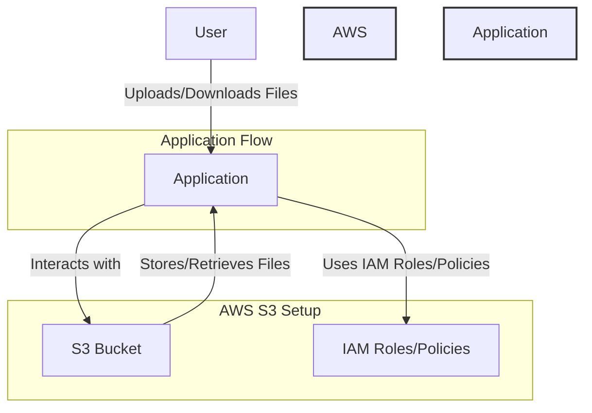

# Launch a Personal Cloud Storage System with Amazon S3



This project helps you set up a personal cloud storage system using AWS S3. Amazon S3 (Simple Storage Service) provides secure, durable, and scalable cloud storage where 
you can store and retrieve any amount of data at any time.

## Description

In this project, you will:
- Create an S3 bucket to store your files.
- Set up security policies to control access to the bucket.
- Enable versioning to track changes to files and protect against accidental deletions.
- Optionally set up lifecycle rules to move old files to cheaper storage classes (e.g., Glacier) to optimize costs.

By the end of this project, you will have a personal cloud storage solution where you can securely upload, manage, and retrieve your files.

## Requirements

- AWS account (sign up at https://aws.amazon.com)
- Basic knowledge of AWS services
- Access to the AWS Management Console

## Steps

### 1. Create an S3 Bucket
1. Go to the [Amazon S3 console](https://s3.console.aws.amazon.com/s3/home).
2. Click on "Create bucket".
3. Provide a unique name for the bucket (e.g., `my-personal-cloud-storage`).
4. Choose the AWS region where you want to create the bucket.
5. Leave other settings as default (you can modify them later if needed).
6. Click "Create bucket".

### 2. Configure Bucket Permissions
1. In the S3 console, click on your newly created bucket.
2. Go to the "Permissions" tab.
3. Set up a **Bucket Policy** to allow access only to specific users or roles:
   - Example policy to grant full access to a specific IAM user:
     ```json
     {
       "Version": "2012-10-17",
       "Statement": [
         {
           "Effect": "Allow",
           "Principal": {
             "AWS": "arn:aws:iam::AWS_ACCOUNT_ID:user/USERNAME"
           },
           "Action": "s3:*",
           "Resource": [
             "arn:aws:s3:::my-personal-cloud-storage",
             "arn:aws:s3:::my-personal-cloud-storage/*"
           ]
         }
       ]
     }
     ```
   - Replace `AWS_ACCOUNT_ID` and `USERNAME` with your AWS account ID and the IAM user name.

4. For public access, it's recommended **not** to allow public access unless necessary for your use case. Ensure "Block Public Access" settings are enabled unless you 
need public file access.

### 3. Enable Versioning
1. Go to the "Properties" tab of your S3 bucket.
2. Find the "Bucket Versioning" section and click "Edit".
3. Enable Versioning and save changes.
   - This ensures that any file changes or deletions are saved as new versions, allowing you to retrieve older versions if necessary.

### 4. Upload Files to S3
1. In the S3 console, click on your bucket.
2. Click on the "Upload" button.
3. Drag and drop files or select files from your computer.
4. Click "Upload" to store files in your S3 bucket.

### 5. Optional: Set up Lifecycle Policies
1. In the "Management" tab, find "Lifecycle rules".
2. Click "Create lifecycle rule".
3. Define a rule to transition files to a different storage class after a specified number of days (e.g., move files to Glacier after 30 days to reduce costs).
4. Set expiration policies if you want to automatically delete files after a certain period.

### 6. Access Your Files
- You can access your files from the S3 console, or use the AWS CLI or SDKs to programmatically upload/download files from S3.
- Example AWS CLI command to upload a file:
  ```bash
  aws s3 cp myfile.txt s3://my-personal-cloud-storage/
  ```

7. (Optional) Set up S3 Bucket Notifications
You can configure your S3 bucket to send notifications (e.g., via SNS or Lambda) when certain events occur, such as file uploads or deletions.

Conclusion
With this setup, you have created your own personal cloud storage solution. You can now securely upload, manage, and retrieve files using AWS S3. Further, you can add 
more features like encryption, automated backups, and cost optimization strategies by exploring other S3 settings.


